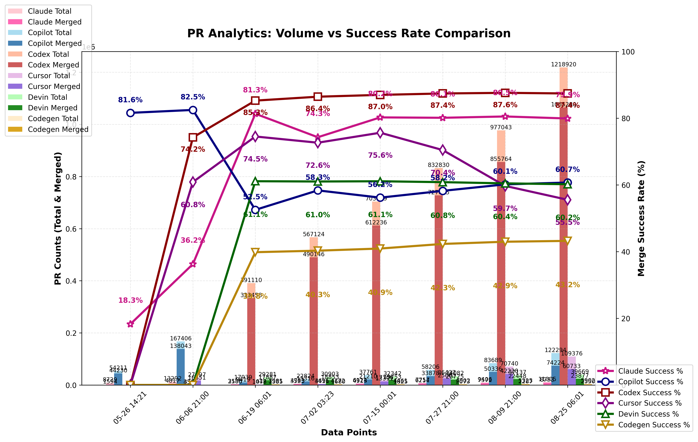

### PR Analytics: Volume vs Success Rate (auto‑updated)

View the [interactive dashboard](https://aavetis.github.io/ai-pr-watcher/) for these statistics.

## Data sources

Explore the GitHub search queries used:

- **All Claude PRs**: [is:pr head:claude/](https://github.com/search?q=is:pr+head:claude/&type=pullrequests)
- **Merged Claude PRs**: [is:pr head:claude/ is:merged](https://github.com/search?q=is:pr+head:claude/+is:merged&type=pullrequests)
- **All Copilot PRs**: [is:pr head:copilot/](https://github.com/search?q=is:pr+head:copilot/&type=pullrequests)
- **Merged Copilot PRs**: [is:pr head:copilot/ is:merged](https://github.com/search?q=is:pr+head:copilot/+is:merged&type=pullrequests)
- **All Codex PRs**: [is:pr head:codex/](https://github.com/search?q=is:pr+head:codex/&type=pullrequests)
- **Merged Codex PRs**: [is:pr head:codex/ is:merged](https://github.com/search?q=is:pr+head:codex/+is:merged&type=pullrequests)
- **All Cursor PRs**: [is:pr head:cursor/](https://github.com/search?q=is:pr+head:cursor/&type=pullrequests)
- **Merged Cursor PRs**: [is:pr head:cursor/ is:merged](https://github.com/search?q=is:pr+head:cursor/+is:merged&type=pullrequests)
- **All Devin PRs**: [author:devin-ai-integration[bot]](https://github.com/search?q=author:devin-ai-integration[bot]&type=pullrequests)
- **Merged Devin PRs**: [author:devin-ai-integration[bot] is:merged](https://github.com/search?q=author:devin-ai-integration[bot]+is:merged&type=pullrequests)
- **All Codegen PRs**: [author:codegen-sh[bot]](https://github.com/search?q=author:codegen-sh[bot]&type=pullrequests)
- **Merged Codegen PRs**: [author:codegen-sh[bot] is:merged](https://github.com/search?q=author:codegen-sh[bot]+is:merged&type=pullrequests)

---

## Current Statistics

| Project | Total PRs | Merged PRs | Merge Rate |
| ------- | --------- | ---------- | ---------- |
| Claude  | 6,538 | 5,246 | 80.24% |
| Copilot | 42,265 | 23,622 | 55.89% |
| Codex   | 735,257 | 640,317 | 87.09% |
| Cursor  | 20,949 | 15,792 | 75.38% |
| Devin   | 32,728 | 19,940 | 60.93% |
| Codegen | 4,512.0 | 1,856.0 | 41.13% |